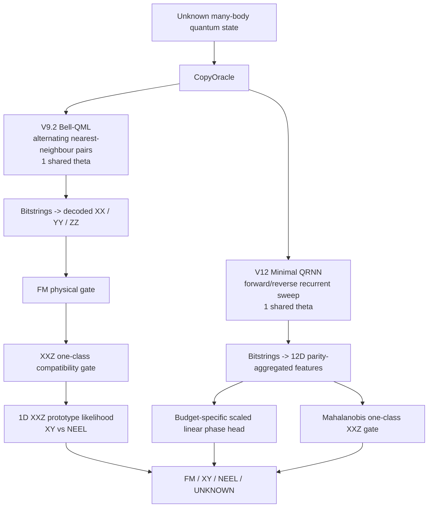

# AQH 2026 — Track 2: The 64-Copy Problem

A reproducible repository for two frozen direct-state QML submissions and the research notebooks that produced them.

> **Public repository boundary:** organizer-private test states, answer keys, hidden predictions, and organizer-only artifacts are deliberately excluded.

## Repository status

| Package | Runtime architecture in `submission.py` | Quantum parameters | Status |
|---|---|---:|---|
| **V9.2** | Alternating nearest-neighbour **Bell-QML incumbent** | **1 shared parameter** (`theta=-pi/2`) | **Validated incumbent / deployment reference** |
| **V12** | **Minimal spatial QRNN** recurrent sweep | **1 shared parameter** (`theta=-pi/4`) | **Experimental public research winner; not promoted** |

A crucial distinction is preserved in this repository: the **V9.2 research notebook** found `M2_QCNN_LOCAL_6P` to be the preliminary public phase-classification winner, but its deployment gate retained the exact incumbent. Therefore the actual V9.2 submission archive is the Bell-QML incumbent, not the six-parameter M2 research candidate.

V12 similarly reports `QRNN_MINIMAL_1P` as the public research winner, while its own manifest says `DEPLOYMENT_DECISION = KEEP_VALIDATED_INCUMBENT`.

## Architecture overview



## What is included

- `submissions/V9_2/` — repo-ready V9.2 incumbent runtime.
- `submissions/V12/` — exact V12 experimental QRNN runtime package.
- `notebooks/` — the executed V9.2 and V12 notebooks exactly as uploaded.
- `results/` — compact CSVs transcribed from executed notebook outputs.
- `docs/` — architecture, methodology, dataset geometry, validation, compliance, and packaging audit.
- `validation/participant_validation.py` — public/participant-side validator with no organizer-private dependency.
- `scripts/validate_repo.py` — static repository QA and private-artifact firewall.
- `releases/` — repo-ready release ZIPs plus untouched original uploaded archives for provenance.

## Reproducibility environment

The executed notebooks report Python 3.12, PennyLane 0.45.1, NumPy 2.0.2, pandas 2.3.3, scikit-learn 1.6.1, and SciPy 1.16.3 for V9.2; V12 reports PennyLane 0.45.1. See `requirements-research.txt` for portable minimums.

## Copy budgets

Both submission interfaces are designed for the mandatory copy curve:

`4 / 8 / 16 / 32 / 64`

The primary low-copy research objective is:

`0.40 * F1@4 + 0.35 * F1@8 + 0.25 * F1@16`

## Validation

Run the repository audit:

```bash
python scripts/validate_repo.py
```

Participant-side evaluation can be run with the supplied participant kit (not bundled here):

```bash
python validation/participant_validation.py --kit /path/to/AQH_64_Copy_Professional_Solution --submission submissions/V12
```

See `docs/VALIDATION_PROTOCOL.md` before interpreting any public self-score.

## Private-data policy

Do **not** commit or publish:

- `hidden_test.npz`
- `answer_key.csv`
- organizer commitment passwords or secrets
- hidden predictions / confusion matrices
- organizer-only test harness folders

The repository CI fails if common private filenames are detected.

## Research conclusion

The public V12 quick-mode study places the minimal QRNN first on the smooth balanced public split, but the margin versus M2 QCNN is not statistically separated and M2 is stronger on the boundary-proxy and fidelity-gap stress splits. The V12 notebook therefore does **not** promote the QRNN over the validated incumbent.

See `docs/MODEL_COMPARISON.md` and `docs/TECHNICAL_REPORT.md` for the complete interpretation.
