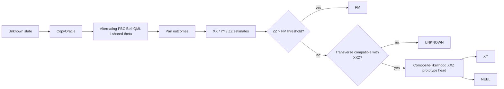
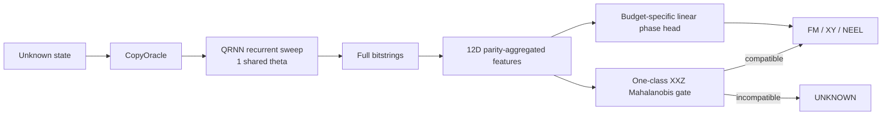

# Architecture

## V9.2 deployed runtime: one-parameter Bell-QML incumbent

The uploaded V9.2 `model_config.json` identifies the frozen runtime as `V8.1-final-frozen`. The circuit applies an alternating periodic nearest-neighbour matching. For each measured pair `(a,b)`:

1. `CNOT(a,b)`
2. `RY(theta)` on `a`
3. computational-basis measurement

with frozen `theta = -pi/2`.

At this angle the pair readout is decoded into estimators of `XX`, `YY`, and `ZZ`. The runtime then follows:



The trainable quantum parameter count is exactly one and does not depend on system size.

## V12 runtime: QRNN_MINIMAL_1P

The V12 package is a spatial recurrent circuit over the ordered spin chain. With frozen `theta = -pi/4`, the recurrent cell is:

```text
RY(theta) on a
CNOT(a -> b)
CNOT(b -> a)
```

Parity 0 sweeps forward over adjacent sites; parity 1 sweeps backward. Each copy produces a full bitstring. The runtime converts each shot into six statistics and concatenates the parity-0 and parity-1 means into a 12D vector:

- pair control mean
- pair target mean
- pair product mean
- global magnetization
- staggered magnetization
- nearest-neighbour correlation

The 12D vector is passed to a budget-specific standardized linear phase head and a one-class Mahalanobis compatibility gate.



## Interface

Both expose the organizer-facing entry point:

```python
classify(oracle, state_ids) -> dict[str, str]
```

No public repository component needs hidden statevectors or hidden labels.
